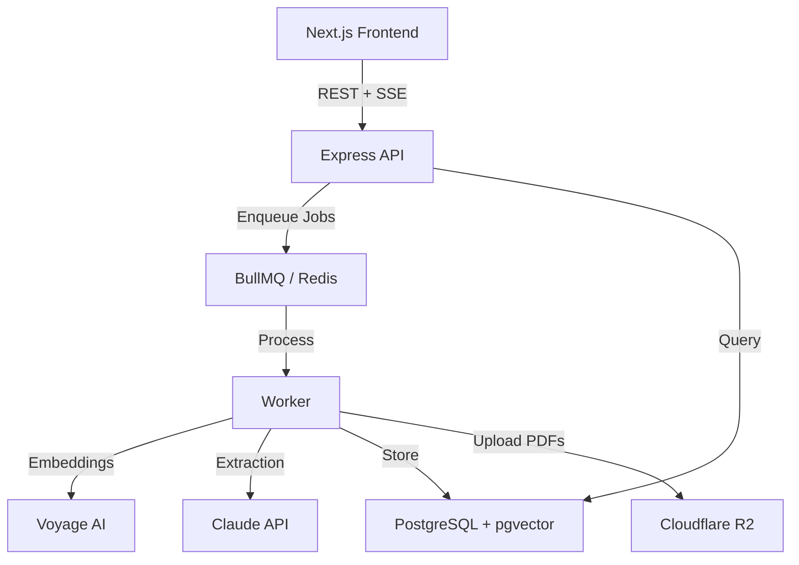

# Technical Overview

## Architecture

The AI Research Assistant is a compound AI application combining structured extraction, streaming responses, background job processing, RAG retrieval, and conversational memory. It is built as a monorepo with four packages.



## Tech Stack

| Layer | Technology |
|-------|-----------|
| Frontend | Next.js 15, React 19, TanStack Query, SCSS Modules |
| API | Express 5, TypeScript, express-session |
| Worker | BullMQ background jobs |
| Database | PostgreSQL with pgvector (Neon) |
| Cache/Queue | Redis (Railway) |
| LLM | Anthropic Claude (claude-3-5-sonnet for chat, claude-3-haiku for extraction) |
| Embeddings | Voyage AI (voyage-3-lite, 1024 dimensions) |
| Storage | Cloudflare R2 (PDF uploads) |
| Auth | Email/password with bcrypt, express-session + Redis store |

## Package Structure

```
packages/
  common/      # Shared types, constants, validation schemas
  server/      # Express API (routes, handlers, repos, services)
  worker/      # BullMQ job processors
  web-client/  # Next.js frontend
```

## Database Schema

### users
Core authentication table with bcrypt-hashed passwords.

| Column | Type | Notes |
|--------|------|-------|
| id | uuid | Primary key |
| email | text | Unique |
| password_hash | text | bcrypt |
| name | text | Optional display name |
| created_at | timestamptz | |

### sources
Stores ingested content with extracted metadata.

| Column | Type | Notes |
|--------|------|-------|
| id | uuid | Primary key |
| user_id | uuid | FK to users |
| type | text | `article`, `pdf`, `note` |
| status | text | `pending`, `processing`, `ready`, `failed` |
| url | text | Original URL (articles) |
| title | text | Extracted or user-provided |
| author | text | Extracted |
| published_date | date | Extracted |
| summary | text | Claude-generated |
| content | text | Full extracted text |
| error | text | Error message if failed |

### chunks
Text fragments with vector embeddings for similarity search.

| Column | Type | Notes |
|--------|------|-------|
| id | uuid | Primary key |
| source_id | uuid | FK to sources |
| user_id | uuid | FK to users |
| content | text | Chunk text (~500 tokens) |
| chunk_index | integer | Position in source |
| embedding | vector(1024) | Voyage AI embedding |

### tags
User-created labels with color coding.

| Column | Type | Notes |
|--------|------|-------|
| id | uuid | Primary key |
| user_id | uuid | FK to users |
| name | text | Tag label |
| color | text | Hex color |

### collections
Groups of sources, optionally shared publicly.

| Column | Type | Notes |
|--------|------|-------|
| id | uuid | Primary key |
| user_id | uuid | FK to users |
| name | text | Collection name |
| description | text | Optional |
| share_token | text | Unique, for public links |
| is_public | boolean | Sharing enabled |

### conversations & messages
Chat history with citation tracking.

| Column | Type | Notes |
|--------|------|-------|
| conversations.id | uuid | Primary key |
| conversations.user_id | uuid | FK to users |
| conversations.title | text | Auto-generated |
| messages.role | text | `user` or `assistant` |
| messages.content | text | Message text |
| messages.cited_chunks | uuid[] | Referenced chunk IDs |

## API Endpoints

### Authentication
| Method | Path | Description |
|--------|------|-------------|
| POST | `/auth/register` | Create account |
| POST | `/auth/login` | Start session |
| POST | `/auth/logout` | End session |
| GET | `/auth/me` | Current user |

### Sources
| Method | Path | Description |
|--------|------|-------------|
| GET | `/sources` | List sources (filterable) |
| POST | `/sources` | Create source (enqueues processing) |
| GET | `/sources/:id` | Get source details |
| DELETE | `/sources/:id` | Delete source + chunks |
| POST | `/sources/:id/reprocess` | Re-run ingestion pipeline |
| POST | `/sources/:id/tags` | Assign tags |
| DELETE | `/sources/:id/tags/:tagId` | Remove tag |

### Tags
| Method | Path | Description |
|--------|------|-------------|
| GET | `/tags` | List user's tags |
| POST | `/tags` | Create tag |
| DELETE | `/tags/:id` | Delete tag |

### Collections
| Method | Path | Description |
|--------|------|-------------|
| GET | `/collections` | List collections |
| POST | `/collections` | Create collection |
| GET | `/collections/:id` | Get collection with sources |
| DELETE | `/collections/:id` | Delete collection |
| POST | `/collections/:id/sources` | Add source to collection |
| DELETE | `/collections/:id/sources/:sourceId` | Remove source |
| POST | `/collections/:id/share` | Enable public sharing |
| GET | `/share/:token` | Public collection view |

### Chat
| Method | Path | Description |
|--------|------|-------------|
| GET | `/conversations` | List conversations |
| POST | `/conversations` | Create conversation |
| DELETE | `/conversations/:id` | Delete conversation |
| GET | `/conversations/:id/messages` | Get message history |
| POST | `/chat` | Send message (SSE streaming response) |

## RAG Pipeline

### Ingestion (Worker)

1. **Content extraction** - `article-extractor` for URLs, `pdf-parse` for PDFs, raw text for notes
2. **Metadata extraction** - Claude (haiku) extracts title, author, date, and summary as structured JSON
3. **Chunking** - Text split into ~500 token chunks with 50 token overlap
4. **Embedding** - Voyage AI (`voyage-3-lite`) generates 1024-dimension vectors per chunk
5. **Storage** - Chunks and embeddings stored in PostgreSQL with pgvector index

### Retrieval (API)

1. **Query embedding** - User's question is embedded using Voyage AI
2. **Vector search** - Cosine similarity search across the user's chunks, returning top 5
3. **Prompt assembly** - Retrieved chunks are injected into Claude's context with source attribution
4. **Generation** - Claude (sonnet) generates a response with `[N]` citation markers
5. **Streaming** - Response streamed to frontend via Server-Sent Events
6. **Citation display** - Frontend replaces markers with interactive badges linking to original sources

### Worker Queues

| Queue | Concurrency | Purpose |
|-------|------------|---------|
| `source-ingest` | 3 | Full ingestion pipeline (extract → chunk → embed → store) |
| `conversation-title` | 5 | Generate 6-word titles from first user/assistant exchange |

## Frontend Architecture

- **App Router** with route groups: `(auth)` for login/register, `(protected)` for authenticated pages
- **TanStack Query** for server state management with optimistic updates
- **SSE streaming** for real-time chat responses
- **SCSS Modules** for component-scoped styling
- **CSS custom properties** for theming

## Deployment

| Service | Platform |
|---------|----------|
| Frontend | Vercel |
| API | Railway |
| Worker | Railway |
| Database | Neon (PostgreSQL + pgvector) |
| Redis | Railway |
| PDF Storage | Cloudflare R2 |
